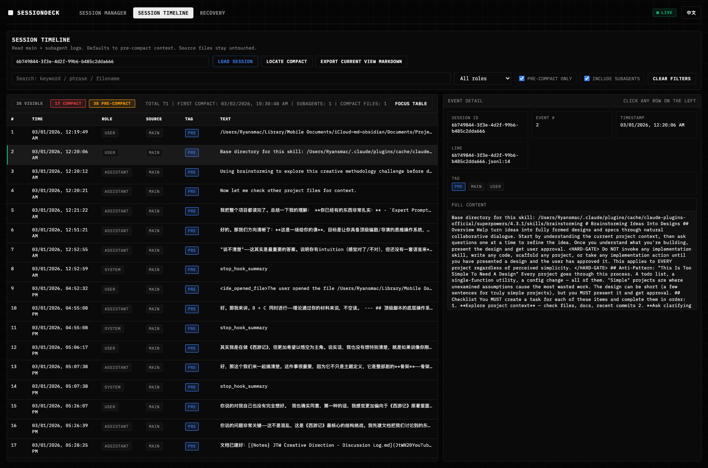

<!-- SEO: SessionDeck – Claude Code session manager, viewer, recovery tool. Browse, search, recover compacted context from Claude Code sessions locally. -->

<div align="center">

# SessionDeck

**The local dashboard for Claude Code sessions — browse, search, recover, and govern your AI coding sessions without touching source data.**

[](./LICENSE)
[](https://nodejs.org/)
[]()
[]()

English | [简体中文](./README.zh-CN.md)

</div>

---

## Why SessionDeck?

Claude Code stores sessions as local JSON files in `~/.claude/projects`. As your sessions grow, you face real problems:

| Problem | Without SessionDeck | With SessionDeck |
|---------|-------------------|-----------------|
| **Finding old sessions** | Manually dig through JSON files | Visual table with search, sort, and filter |
| **Lost context after compaction** | Gone forever — Claude auto-compacts long sessions | **Session Timeline** reads pre-compact snapshots |
| **Accidental deletion** | `rm` = permanent loss | Safe delete via system Trash only |
| **Searching across sessions** | Impossible without scripting | Full-text search across all sessions + subagents |
| **Exporting conversations** | Copy-paste from JSON | One-click Markdown export (single or batch) |
| **Understanding session history** | Raw JSON reading | Visual timeline with role-colored messages |

> **TL;DR** — SessionDeck is a **read-only dashboard** that sits on top of your Claude Code session files. It never modifies source data. It gives you visibility, searchability, and recovery capabilities that Claude Code itself doesn't provide.

## Key Features

### 🗂️ Session Manager
- **Visual session browser** — project name, summary, first/last prompt, message count, timestamps
- **Keyword search & filtering** — find any session instantly
- **Custom naming & tagging** — via sidecar metadata (never modifies source files)
- **Batch selection & export** — export multiple sessions to Markdown at once
- **Safe delete** — moves to system Trash, never hard-deletes

### 🔍 Session Timeline
- **Load full conversation timeline** by session ID (main session + subagents)
- **View pre-compact context** — recover messages that Claude Code auto-compacted
- **Locate compact points** — see exactly where and when compaction happened
- **Export to Markdown** — save the full recovered timeline

### ♻️ Recovery
- **Restore deleted sessions** from system Trash back to original paths
- **Search recoverable records** by session ID/path/status
- **Track recovery status** (deleted / restored / failed)
- **Return to Session Manager** after restore workflow

### 🔧 Advanced Tools
- **Rebuild `sessions-index.json`** — fix corrupted index without touching session data
- **Full-text search** — search across all sessions with optional subagent inclusion
- **Global search** — find keywords across your entire session library

### 🎨 Interface
- **War-room terminal aesthetic** — dark monospace UI designed for information density
- **Bilingual** — English / 中文 toggle
- **Desktop-first, mobile-compatible** — responsive layout

## Data Safety

SessionDeck enforces strict read-only boundaries:

```
 ┌─────────────────────────────────────────────┐
 │  ~/.claude/projects  (YOUR SESSION DATA)    │
 │                                             │
 │  SessionDeck READS ───────► Display in UI   │
 │  SessionDeck NEVER writes to session files  │
 │                                             │
 │  Delete = System Trash only (recoverable)   │
 │  Tags/Names = Sidecar files (separate)      │
 └─────────────────────────────────────────────┘
```

## Quick Start

### One-liner (Terminal)

```bash
git clone https://github.com/gaoryan86/sessiondeck.git
cd sessiondeck && ./run.sh
```

Open **http://127.0.0.1:47831** in your browser.

### Double-click Launch

| Platform | Start | Stop |
|----------|-------|------|
| **macOS** | `Session Deck.command` | `Stop Session Deck.command` |
| **Windows** | `Session Deck.bat` | `Stop Session Deck.bat` |

### macOS Spotlight Integration

```bash
./scripts/install-macos-launcher.sh
```
Creates `~/Applications/Session Deck.app` — searchable via Spotlight.

## Screenshots

### Session Manager


### Session Timeline



### Recovery


## Requirements

- **Node.js 18+** (no other dependencies — zero `npm install` needed)
- Claude Code installed with local sessions at `~/.claude/projects`

## Configuration

| Variable | Default | Description |
|----------|---------|-------------|
| `PORT` | `47831` | Server port |
| `CLAUDE_PROJECTS` | `~/.claude/projects` | Claude Code sessions directory |

```bash
PORT=47840 CLAUDE_PROJECTS="$HOME/.claude/projects" ./run.sh
```

## Architecture

```
SessionDeck/
├── index.html          # Single-page frontend (HTML + CSS + JS)
├── server.mjs          # Node.js HTTP server (zero dependencies)
├── run.sh              # Cross-platform launch script
├── Session Deck.command # macOS double-click launcher
├── Session Deck.bat    # Windows double-click launcher
└── docs/               # Screenshots and documentation
```

- **No framework, no build step, no npm install** — just `node server.mjs`
- Single `index.html` for the entire frontend
- Pure Node.js HTTP server with zero external dependencies

## Use Cases

- **Developers using Claude Code daily** who need to find past sessions quickly
- **Recovering lost context** after Claude Code auto-compacts long conversations
- **Auditing AI interactions** — review what Claude did across projects
- **Exporting conversations** for documentation, sharing, or archival
- **Managing session sprawl** — hundreds of sessions across dozens of projects

## FAQ

<details>
<summary><strong>Does SessionDeck modify my Claude Code sessions?</strong></summary>

No. SessionDeck is strictly read-only. The only write operation is deletion, which goes through the system Trash (fully recoverable). Custom names and tags are stored in separate sidecar files.
</details>

<details>
<summary><strong>Does it work with Claude Code on all platforms?</strong></summary>

Yes. SessionDeck works on macOS, Windows, and Linux wherever Claude Code stores sessions locally.
</details>

<details>
<summary><strong>Can I recover compacted sessions?</strong></summary>

Yes — this is one of SessionDeck's core features. The `Session Timeline` tab reads pre-compact snapshot data that Claude Code keeps but doesn't expose in its own UI.
</details>

<details>
<summary><strong>Does it need internet access?</strong></summary>

No. SessionDeck runs 100% locally. No data is ever sent anywhere.
</details>

## Project Status

- Current release: `v0.1.6`
- See [`CHANGELOG.md`](./CHANGELOG.md) for release history

## Contributing

Please read [`CONTRIBUTING.md`](./CONTRIBUTING.md) before opening PRs.

## Security

Report vulnerabilities via [`SECURITY.md`](./SECURITY.md).

## License

MIT License. See [`LICENSE`](./LICENSE).

---

<div align="center">

**SessionDeck** — See everything Claude Code doesn't show you.

</div>
