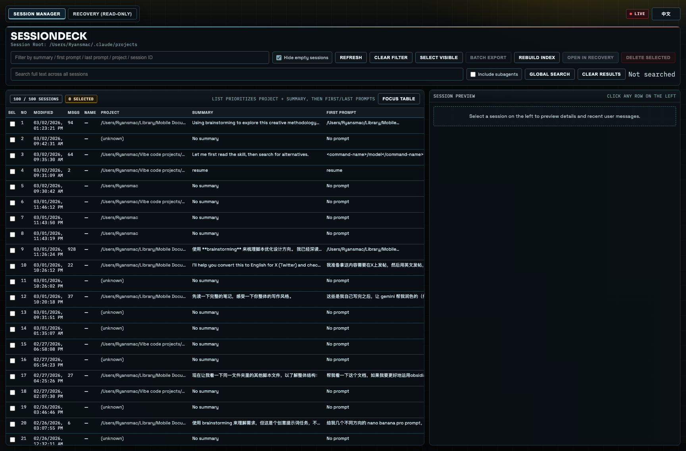
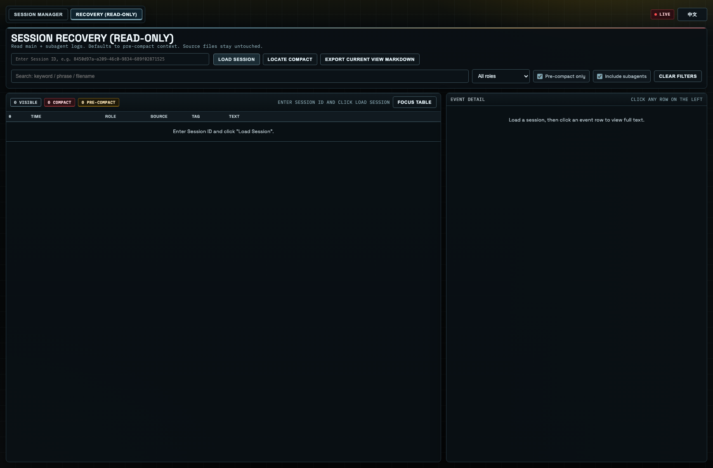

# SessionDeck

[English](./README.md) | 简体中文

SessionDeck 是一个本地 Web 工具，用来管理 Claude Code 本地会话，强调可视化浏览 + 安全治理 + 不改源数据。

## 功能

### Session Manager（会话管理）

- 列表展示：`project`、`summary`、`first prompt`、`last prompt`、`message count`、`modified time`
- 关键词过滤与批量选择
- 安全删除：移动到系统 Trash（不是硬删）

### Recovery（只读恢复）

- 按 `sessionId` 加载主会话 + subagents
- 支持“只看压缩前”上下文
- 支持定位 compact 点
- 支持导出当前视图 Markdown

### 进阶能力

- 重建官方 `sessions-index.json`（不改 session 内容）
- 跨 session 全文搜索（可包含 subagents）
- 会话命名/标签（sidecar，不改原 session）
- 批量导出选中会话为 Markdown

### 界面

- 默认英文，支持 EN/中文切换
- War Room 风格主题

## 数据安全边界

- Recovery 为只读。
- 命名与标签写入 sidecar 元数据，不改源会话文件。
- 只有删除操作会触碰会话文件，且走系统 Trash。

## 架构

- 前端：单页 `index.html`
- 后端：Node.js `server.mjs`
- 启动脚本：
- macOS：`Session Deck.command`、`Stop Session Deck.command`
- Windows：`Session Deck.bat`、`Stop Session Deck.bat`
- 跨平台终端：`run.sh`

## 环境要求

- Node.js 18+
- Claude Code 会话目录（默认 `~/.claude/projects`）

## 快速启动

### 方式 A：双击（macOS）

- `Session Deck.command`：启动并自动打开浏览器
- `Stop Session Deck.command`：停止服务

### 方式 B：双击（Windows）

- `Session Deck.bat`：启动并自动打开浏览器
- `Stop Session Deck.bat`：停止服务

### 方式 C：终端

```bash
cd "/path/to/SessionDeck"
./run.sh
```

默认地址：<http://127.0.0.1:47831>

## Spotlight 启动（macOS）

安装可被 Spotlight 搜索到的启动器：

```bash
./scripts/install-macos-launcher.sh
```

脚本会创建：`~/Applications/Session Deck.app`

## 截图

### Session Manager



### Recovery（只读）



## 配置

- `PORT`（默认 `47831`）
- `CLAUDE_PROJECTS`（默认 `~/.claude/projects`）

```bash
PORT=47840 CLAUDE_PROJECTS="$HOME/.claude/projects" ./run.sh
```

## 项目状态

- 当前目标版本：`v0.1.2`
- 发布记录见 [`CHANGELOG.md`](./CHANGELOG.md)

## 贡献

请先阅读 [`CONTRIBUTING.md`](./CONTRIBUTING.md)

## 安全

漏洞报告流程见 [`SECURITY.md`](./SECURITY.md)

## 许可证

MIT License，见 [`LICENSE`](./LICENSE)
